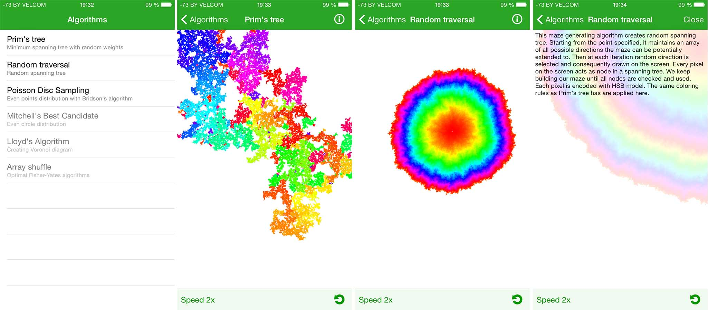

## AlgoPlay
# Introduction
The world of computer programming algorithms may seem pretty complex. AlgoPlay makes it much easier for you to understand the way this or that algorithm works by providing nice and colorful visual experience.
<a href="https://itunes.apple.com/us/app/algoplay/id1163524925">Available on the Appstore</a>
# Usage
* Choose an algorithm you would like to watch
    * Prim's minimum spanning tree
    * Random spanning tree
    * Bridson's algorithm for Poisson's disc sampling
    * More coming!
* Adjust speed of the demonstration by clicking at the bottom left corner
* Get comprehensive description of the way each algorithm works by pressing info button

# Screenshots

# Employed technologies
* Swift, Core Graphics, Core Animation, UIKit
* Minimum spanning tree
* MinHeap Data Structure
* QuadTree
* Poisson's Disc Distribution
* Bridson's Algorithm for incremental Poisson's generation

# To-do
- [ ] Mitchell's best candidate algorithm
- [ ] Lloyd's algorithm
- [ ] Array shuffling
